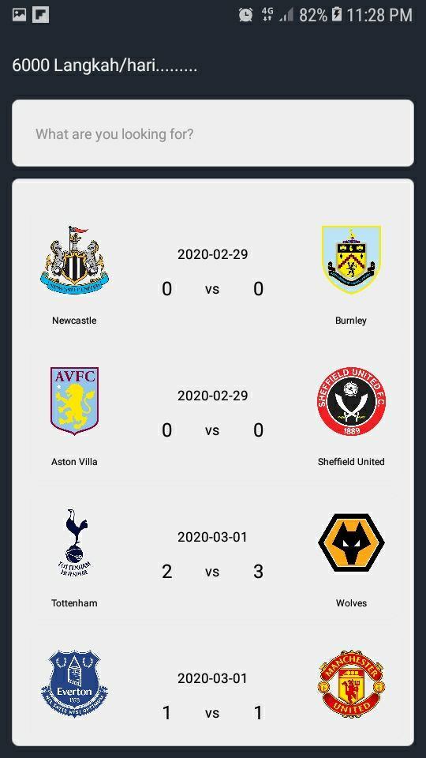
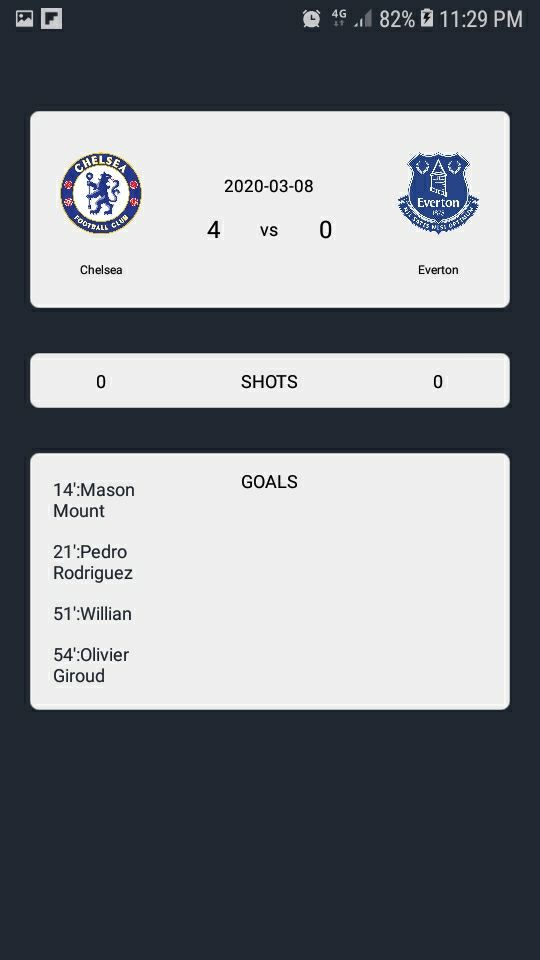
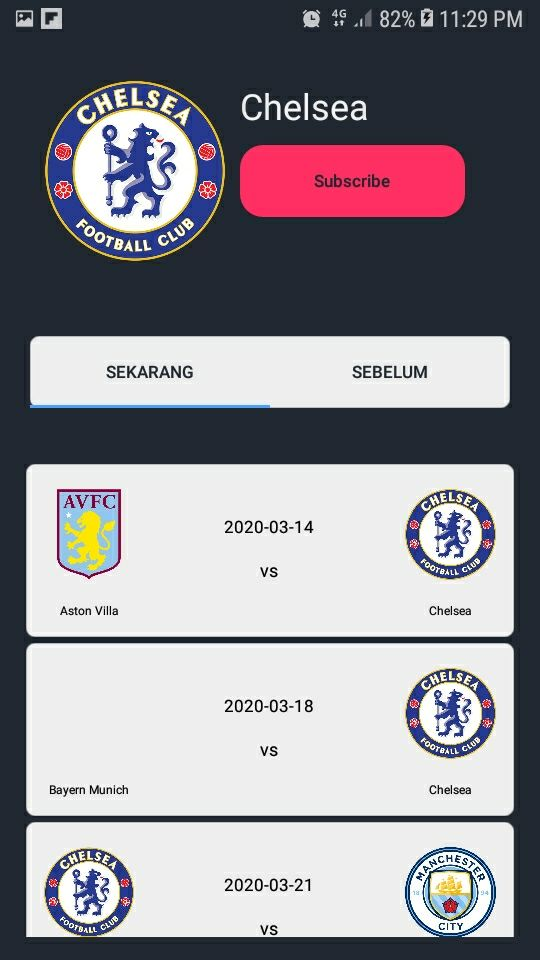

# IF3210-2020-BolaSepak

## Deskripsi aplikasi
BolaSepak merupakan sebuah aplikasi berbasis android dengan fitur utama berupa 
pemberitahuan jadwal pertandingan, statistik pertandingan, dan track record 
suatu team. Pada aplikasi ini, pengguna dapat mensubscribe terhadap suatu tim 
sepak bola pilihan-nya dan dengan mensubscribe, pengguna akan menerima 
notifikasi apabila tim tersebut akan bertanding. Selain itu, juga terdapat 
beberapa fitur tambahan, yaitu fitur pencarian pertandingan dan tracking jumlah
langkah yang telah dilakukan oleh pengguna setiap harinya.

## Cara kerja, terutama mengenai pemenuhan spesifikasi aplikasi
### Fitur Schedule
    1. Dalam mendapatkan jadwal terkini, kami menggunakan API dari thesportsdb
    2. Kami mengambil data dari API dengan melakukan JSONObjectRequest dengan 
    library Volley yang nantinya akan diproses sehingga dapat dimasukkan ke 
    dalam template schedule yang telah dibuat
    3. Kami melakukan 3 kali request, request pertama untuk mengambil idTeam
    dan logo team, request kedua untuk mengambil jadwal pertandingan yang telah
    usai, dan request ketiga untuk mengambil jadwal pertandingan yang akan 
    datang
    4. Template dibuat dengan menggunakan card view yang nantinya akan ditempel
    ke recycler view menggunakan adapter
    5. Adapter juga berfungsi untuk memasukan data-data yang telah diambil ke
    dalam template
    6. Schedule ini akan ditampilkan di halaman homescreen dan juga halaman
    team detail. Di dalam halaman team detail berisi event-event yang telah
    dilakukan oleh sebuah team maupun yang akan dilakukan oleh sebuah tim. Kedua
    nya ditampilkan ke dalam bentuk Tab, menggunakan fragment.
    
## Library yang digunakan dan justifikasi penggunaannya
    1. Volley
        Digunakan untuk melakukan pengambilan data API.
    2. Picasso
        Digunakan untuk menempelkan foto dari data di API yang berbentuk
        url ke template yang berbentuk imageView.
    3. RecyclerView
        Digunakan untuk 
    4. JSON
        Digunakan untuk melakukan pengambilan data API.

## Screenshot aplikasi
1. Homescreen

2. Event Detail

3. Team Detail

#### 13517005 - Muhammad Rafi Zhafran
#### 13517116 - Ferdy Santoso
#### 13517128 - Yudy Valentino

